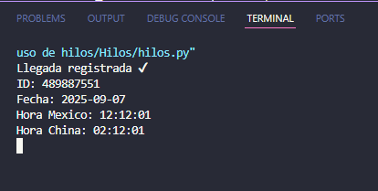

# Práctica: Uso de Hilos y Excepciones 

Este proyecto contiene un ejemplo de cómo se utilizan hilos en la aplicación de MovilOil para el registro de los distribuidores. Se implementa una interfaz gráfica en Python que utiliza hilos para actualizar la hora de diferentes países y gestionar registros de llegada de distribuidores, demostrando tolerancia a fallos y separación de responsabilidades.

## Hilos utilizados

En este caso estamos usando 3 hilos:

- **hilo_mex**: Encargado de actualizar la hora de México.
- **hilo_china**: Se encarga de actualizar la hora de China.
- **hilo_registro**: Se encarga de actualizar las casillas bloqueadas en la interfaz en conjunto con la función `actualizar_registro`.

Esto hace que la interfaz gráfica sea más intuitiva para el usuario y, al mismo tiempo, se mantienen los registros separados para ser guardados en la base de datos.

En este ejemplo, cada hilo se encarga de obtener y actualizar la hora de un país:

- **Hilo de México:** Actualiza la hora local de México.
- **Hilo de China:** Actualiza la hora local de China.

El sistema está diseñado para ser tolerante a fallas. Si el hilo encargado de actualizar la hora de México falla o deja de funcionar, el sistema sigue operando normalmente utilizando la hora de China.


## Importancia de la hora de China

La hora de China es la más importante en este sistema, ya que la empresa es de nacionalidad china. Por esta razón, en el registro general del sistema siempre se guarda la hora de China, asegurando así la consistencia y confiabilidad de los registros, incluso si el hilo de México presenta fallas.

## Registro de llegada

Al momento de ser registrada una llegada, por el momento se mandan los datos, los cuales podemos ver en consola para fines prácticos, y se limpia el campo de entrada ID para facilitar el siguiente registro.



## Simulación de fallos y tolerancia

En este caso se simula una falla en el hilo de México cada 10 segundos para fines prácticos, lo cual lanza un mensaje en consola informando del error. Al mismo tiempo, se manda llamar la función de supervisor, la cual restablece el hilo y hace que el sistema siga funcionando sin necesidad de que el usuario se dé cuenta en ese momento.


Seguidamente, después de la falla, se ejecuta la función supervisor, lo que restablece un hilo para que el sistema siga funcionando de forma correcta y se muestran los mensajes:

- **Reiniciando el hilo**: cuando el hilo se está reiniciando.
- **Hilo reiniciado**: cuando el hilo ha sido reiniciado.


## Resumen y consideraciones

El uso de hilos permite que la interfaz gráfica se mantenga actualizada en tiempo real y que el sistema sea tolerante a fallos, reiniciando automáticamente los procesos críticos sin intervención del usuario. Esto es fundamental en aplicaciones donde la disponibilidad y la confiabilidad son importantes.

La estructura modular y el manejo de excepciones aseguran que los registros y la experiencia del usuario no se vean afectados por errores temporales en los hilos.

---

## Requisitos previos

- Python 3.8 o superior
- Librerías: `tkinter` (incluida en la mayoría de instalaciones de Python), `pytz`

Para instalar pytz:

```bash
pip install pytz
```

## Reutilización de funciones en otros programas

Las siguientes funciones y estructuras pueden ser fácilmente adaptadas a otros proyectos que requieran concurrencia o actualización periódica de datos:

- **mostrar_hora**: Permite actualizar información en tiempo real usando hilos.
- **actualizar_registro**: Útil para sincronizar datos de diferentes fuentes o zonas horarias.
- **supervisor**: Permite reiniciar automáticamente cualquier función que se ejecute en un hilo si ocurre una excepción, aumentando la tolerancia a fallos.

Estas funciones pueden ser copiadas y adaptadas para monitorear sensores, actualizar interfaces, manejar tareas repetitivas, etc.

## ¿Cómo funcionan los hilos y las excepciones en este sistema?

El sistema utiliza la librería `threading` de Python para crear hilos que ejecutan funciones en paralelo. Cada hilo se encarga de una tarea específica (actualizar hora, actualizar registros, etc.), lo que permite que la interfaz gráfica siga siendo responsiva y que los datos se actualicen en tiempo real.

Las excepciones dentro de los hilos son capturadas y reportadas en consola. Si ocurre un error, el supervisor detecta la excepción y reinicia el hilo automáticamente, asegurando que el sistema siga funcionando sin intervención del usuario. Este enfoque es útil en aplicaciones donde la disponibilidad y la robustez son críticas.


---

<div align="center">
	<b>✨ OCHOA ORTEGA ANDREA J.</b>  
	<sub>  Computación Tolerante a Fallas D06.</sub>  
	<br>
	
	
	<br><br>
	<i>“Lo que esta bien hecho no se va a romper.”</i>
</div>


